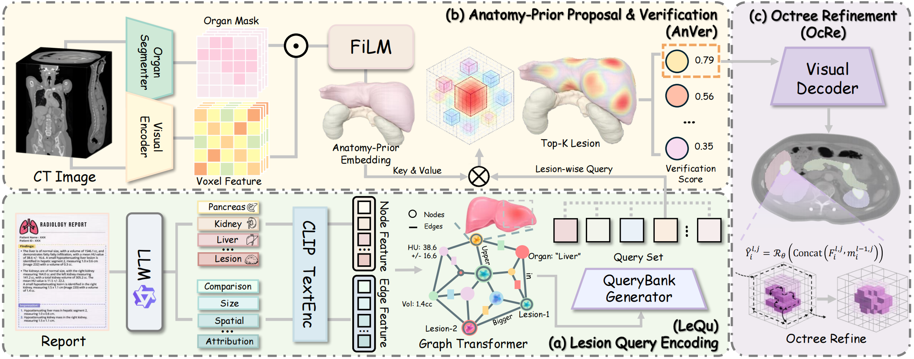
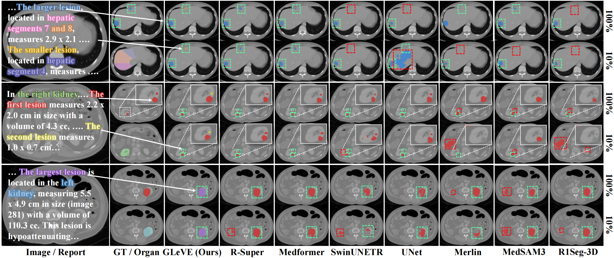

# GLeVE

## GLeVE: Graph-Guided Lesion Grounding with Proposal Verification in 3D CT

<p align="center">
  
</p>

<p align="center">
  
</p>

<p align="center">
  
</p>

---

# Installation

## 1. Create Conda Environment

```bash
conda create -n gleve python=3.10 -y
conda activate gleve
```

## 2. Install Dependencies

```bash
pip install -r requirements.txt
```

(Optional) Set HuggingFace cache:

```bash
export HF_HOME=/data/hf_cache
export HF_ENDPOINT=https://hf-mirror.com
```

---

# Dataset Structure

Download the dataset from [[ICCV 2025] AbdomenAtlas 3.0 (9,262 CT volumes + medical reports)](https://github.com/MrGiovanni/RadGPT)

## CT Images

```text
data/altas/Image_only/
  BDMAP_xxx/
    ct.nii
  BDMAP_yyy/
    ct.nii
```

## Segmentation Masks

The corresponding organs are segmented with
[TotalSegmentator](https://github.com/wasserth/TotalSegmentator), and the
resulting organ masks are subsequently merged with the lesion masks to produce
the final segmentation labels.

```text
data/altas/combined_labels/
  BDMAP_xxx/
    combined_labels.nii
  BDMAP_yyy/
    combined_labels.nii
```

Mask label mapping:

```python
labels_n = [
    "background",  # 0
    "kidney_right",  # 1
    "kidney_left",  # 2
    "kidney_lesion_kidney_right",  # 3
    "kidney_lesion_kidney_left",   # 4
    "pancreas",  # 5
    "pancreatic_lesion",  # 6
    "liver",  # 7
    "liver_lesion",  # 8
]
```

---

# Offline Graph Construction

## Lesion-Level Structured Parsing + Graph Construction

```bash
python offline_build_GLeVE_graph.py \
  --input_csv "/data/AbdomenAtlas3.0MiniWithMeta.csv" \
  --id_col "BDMAP ID" \
  --report_col "structured report" \
  --model_name_or_path "/data/Qwen3-8B" \
  --out_dir "/data/gleve_offline/" \
  --create_attr_nodes \
  --keep_extracted_in_json
```

Output directory:

```text
/data/gleve_offline/
  graphs/
    BDMAP_xxx.graph.json
  embeddings/
    BDMAP_xxx.text_emb.npz
  failed/
    failed_ids.txt
```

Each graph JSON stores:

- lesion nodes
- organ nodes
- attribute nodes
- relational edges
- lesion volume / HU for weak supervision
- extracted structured report fields in `meta.extracted`

Each embedding file stores:

- CLIP node embeddings aligned with graph nodes

---

# Training CSV Filtering

Before training, you may use `filter_train_csv_has_lesion.py` to remove normal
samples without tumors from the training CSV.

This script keeps only cases that satisfy both of the following conditions:

- the corresponding graph contains lesion nodes
- the corresponding segmentation mask contains lesion voxels

Example:

```bash
python filter_train_csv_has_lesion.py \
  --input_csv data/IID_train.csv \
  --graph_root data/gleve_offline/graphs \
  --mask_root data/altas/combined_labels \
  --output_csv data/IID_train_has_lesion.csv \
  --removed_ids_txt data/IID_train_no_lesion.txt \
  --id_col "BDMAP ID"
```

The filtered CSV can then be passed to `train_gleve.py` through `--train_csv`.

---

# Training

`train_gleve.py` already defines a full set of defaults. In practice, you usually only need to override dataset paths and output paths.


Path-related defaults should be adjusted to match your local environment as needed:

- `train_csv`
- `val_csv`
- `image_root`
- `mask_root`
- `graph_root`
- `emb_root`
- `exclude_ids`
- `save_dir`
- `physical_stats_json` (not needed for the first run; optional for subsequent runs)
- `load_ckpt` (optional)

## Full Supervision

The following example keeps the script defaults and only overrides the most common path arguments:

```bash
python train_gleve.py \
  --train_csv data/IID_train_has_lesion.csv \
  --val_csv data/val.csv \
  --image_root data/altas/Image_only \
  --mask_root data/altas/combined_labels \
  --graph_root data/gleve_offline/graphs \
  --emb_root data/gleve_offline/embeddings \
  --exclude_ids data/gleve_offline/failed_ids.txt \
  --save_dir ./ckpts_default \
  --load_ckpt ""
```

This command uses the default training behavior from `train_gleve.py`, including:

- `mask_ratio=1.0`
- `epochs=100`
- `lr=2e-5`
- `patch_size=128 128 128`
- `amp=bf16`
- `grad_accum_steps=4`

## Weak + Partial Supervision

For partial mask supervision, only change `mask_ratio` and keep the rest of the defaults unchanged:

```bash
python train_gleve.py \
  --train_csv data/train.csv \
  --val_csv data/val.csv \
  --image_root data/altas/Image_only \
  --mask_root data/altas/combined_labels \
  --graph_root data/gleve_offline/graphs \
  --emb_root data/gleve_offline/embeddings \
  --exclude_ids data/gleve_offline/failed_ids.txt \
  --save_dir ./ckpts_mask10 \
  --load_ckpt "" \
  --mask_ratio 0.1
```

### What `mask_ratio` Means

- `1.0`: all samples use pixel-level mask supervision
- `0.1`: only 10% of samples use `L_seg`
- remaining samples use report-driven weak loss

### Notes

- `--load_ckpt` is empty by default in `train_gleve.py`, so training starts from scratch unless a checkpoint path is provided.
- Validation runs every `5` epochs by default when `--val_csv` is provided.
- Checkpoints are saved every `5` epochs and at the final epoch.

---

# Model Components

### LeQu

Graph relational encoding for lesion-wise queries.

### AnVer

Region-level proposal verification using:

- organ coverage
- volume consistency
- intensity alignment

### OcRe

Octree-based autoregressive refinement:

- recursive spatial subdivision
- coarse-to-fine residual prediction
- shared refinement weights

### Visual Backbone

3D MedFormer encoder-decoder.
